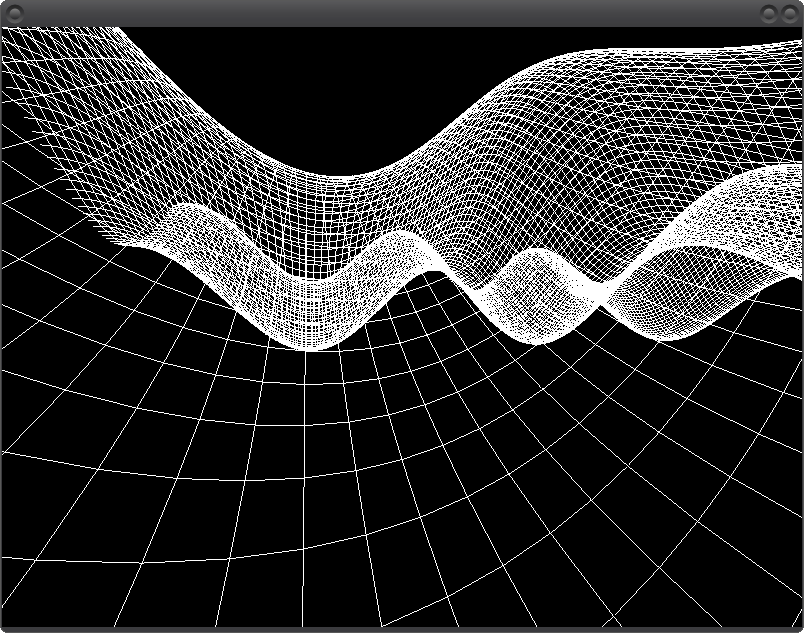

# 3d Thingy

This is my experiment with creating a 3d game using SDL 2.
I do all the 3d-ness myself, and I use SDL2 only for drawing points on a window.

You can use arrow keys to move around, or fly and land with `w` and `s` keys.

## Compiling

    $ sudo apt install git gcc make pkg-config libsdl2-dev
    $ git clone https://github.com/Akuli/3dthingy
    $ cd 3dthingy
    $ make
    $ ./3dthingy

I have no idea what you need to do if you don't have apt.

## Running IWYU

1. Install cmake

        $ sudo apt install cmake

2. Add LLVM 8 stuff to your `sources.list` from https://apt.llvm.org and
   install the stuff:

        $ sudo nano /etc/apt/sources.list
        $ sudo apt update
        $ sudo apt install llvm-8-dev libclang-8-dev clang-8

    Again, I have no idea what you should do if you don't have apt. Sorry.

3. Clone IWYU and compile it

        $ git clone https://github.com/include-what-you-use/include-what-you-use ~/iwyu
        $ cd ~/iwyu
        $ mkdir build
        $ cd build
        $ cmake ../include-what-you-use -DCMAKE_PREFIX_PATH=/usr/lib/llvm-8

    **If you get a CMake error**, look for `llvm-something` in the error
    message. If the `something` part is NOT `8`, then the build is using
    the wrong LLVM version, and you need to make sure that the `-D` part
    of the `cmake` command ends with 8. The same command is in IWYU's
    README with 7 instead of 8.

4. Compile the IWYU

        $ make -j2

    This takes a long time and about a gigabyte of RAM because IWYU is
    written in C++. I don't like C++.

5. Run the IWYU

        $ cd ~/path/to/3dthingy
        $ export IWYU=~/iwyu/build/bin/include-what-you-use
        $ make iwyu

    If you get an error about IWYU not finding `<stdbool.h>` or some
    other include file, try this instead:

        $ export IWYU='~/iwyu/build/bin/include-what-you-use -I/usr/include/clang/8/include'
        $ make iwyu

    With this, sometimes IWYU suggest `"stdbool.h"` instead of
    `<stdbool.h>` to me, but at least it's better than nothing. Adding
    `#include <stdbool.h>` instead of copy/pasting IWYU's suggestion
    works, too.
